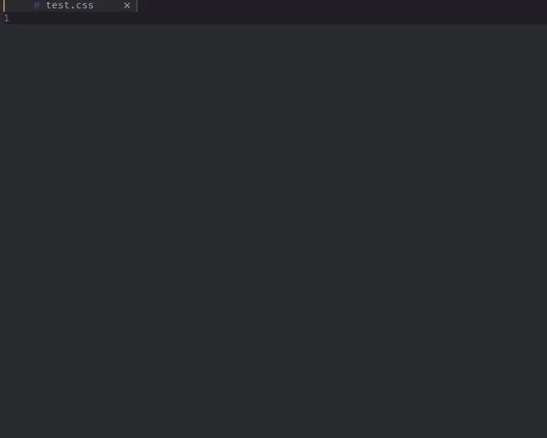
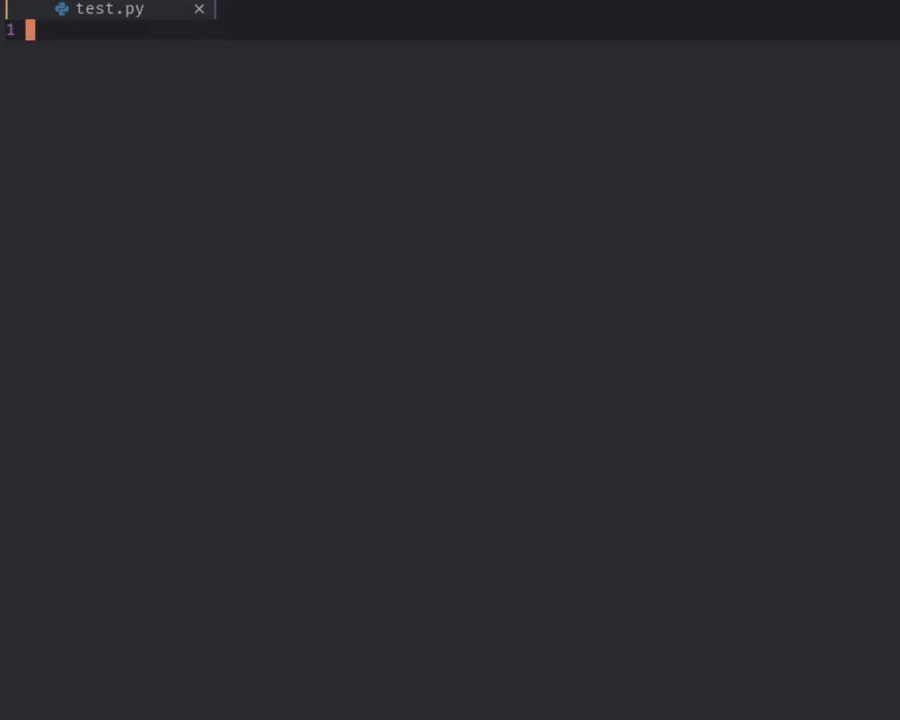
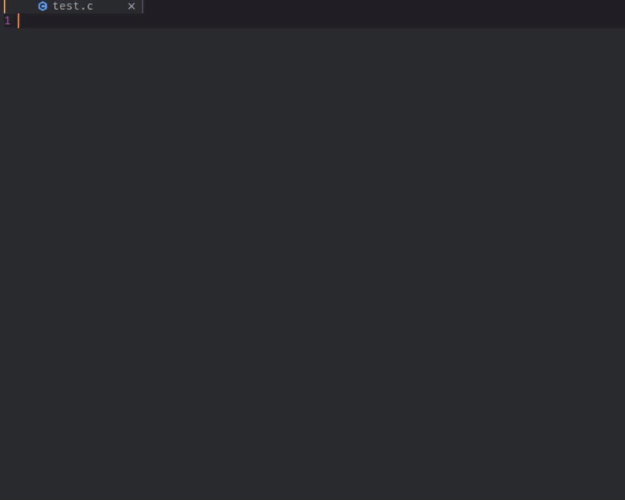

# Friendly Snippets

Snippets collection for a set of different programming languages for faster development. This repository has been forked from couple of VSCode Snippets extensions.

## Goal

The only goal is to have one community driven repository for all kinds of snippets in all programming languages, this way you can have it all in one place.

## Contributing

You can commit all kinds of useful snippets that you may have for personal use, but first make sure that the snippets don't already exist, so we don't have duplicates and it doesn't become a pain to maintain.

### Snippets for:

- HTML, Pug, Jade
- CSS, Sass, Less, Stylus
- Javascript, Typescript, Javascriptreact, Typescriptreact
- Vue
- PHP
- Python
- C
- C++
- Rust
- Go
- Eruby
- Ruby
- Swift
- Java
- Fortran
- Lua
- LaTex
- Shell
- Markdown
- Sql

### Usage

This collection of snippets works with [vim-vsnip](https://github.com/hrsh7th/vim-vsnip) **_(It may work with others snippet plugins but haven't tested)_**, which can load snippets with the same format and syntax that VSCode snippets extensions uses.

For setting up vim-vsnip refer to this [link](https://github.com/hrsh7th/vim-vsnip#usage).

### Install

Packer

```lua
use "rafamadriz/friendly-snippets"
use "hrsh7th/vim-vsnip"
```

Plug

```viml
Plug 'rafamadriz/friendly-snippets'
Plug 'hrsh7th/vim-vsnip'
```

### Just a few examples of snippets in action

#### HTML


#### JS


#### CSS



#### Pyhton



#### C



## For for more details go to the [Wiki](https://github.com/rafamadriz/friendly-snippets/wiki)

## TODO

- Complete the list for all snippets included in the [Wiki](https://github.com/rafamadriz/friendly-snippets/wiki), so it's easier for contributors to see which snippets are already included.

## Credits

A good portion of the snippets have been forked from the following repositories:

- [vscode-standardjs-snippets](https://github.com/capaj/vscode-standardjs-snippets)
- [python-snippets](https://github.com/cstrap/python-snippets)
- [vs-snippets](https://github.com/kitagry/vs-snippets)
- [Wscats/html-snippets](https://github.com/Wscats/html-snippets)
- [Harry-Ross/vscode-c-snippets](https://github.com/Harry-Ross/vscode-c-snippets)
