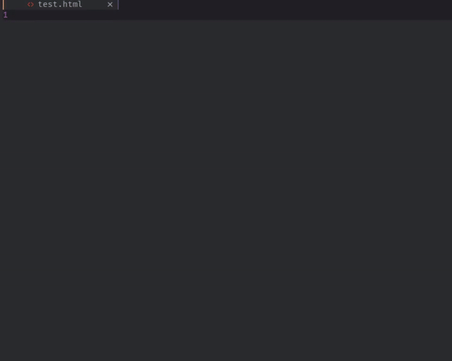
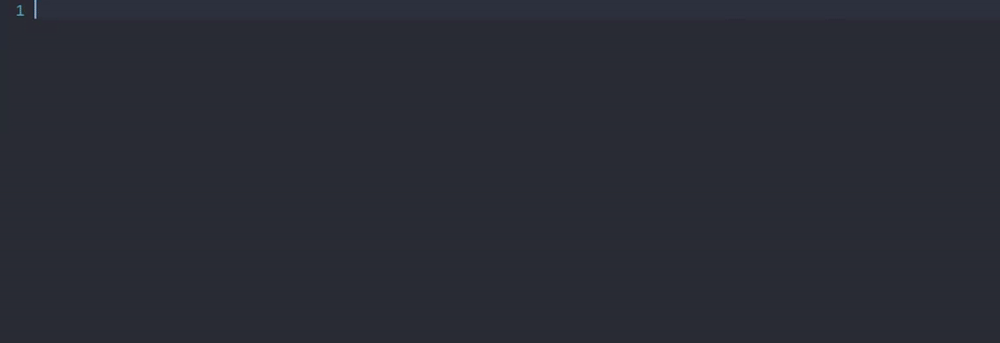

# Friendly Snippets

Snippets collection for a set of different programming languages for faster development.

## Goal

The only goal is to have one community driven repository for all kinds of
snippets in all programming languages, this way you can have it all in one
place.

## Contributing

You can commit all kinds of useful snippets that you may have for personal use,
but first make sure that the snippets don't already exist, so we don't have
duplicates.

### Snippets for:

- HTML, Pug, Jade
- CSS, Sass, Less, Stylus
- JavaScript, Typescript, Javascriptreact, Typescriptreact
- Vue
- PHP
- Python
- C
- C++
- Rust
- Go
- Haskell
- Eruby
- Ruby
- Swift
- Java
- Fortran
- Lua
- LaTex
- Shell
- Markdown
- Sql
- Rails
- Elixir
- Fennel

### Usage

This collection of snippets should work with any plugin that supports loading
vscode snippets. Like for example:

- [vim-vsnip](https://github.com/hrsh7th/vim-vsnip)
- [LuaSnip](https://github.com/L3MON4D3/LuaSnip)
- [coc-snippets](https://github.com/neoclide/coc-snippets)

### Install

Use your plugin manager of choice, e.g.

```lua
-- Packer
use "rafamadriz/friendly-snippets"

-- Plug
Plug 'rafamadriz/friendly-snippets'

-- If you're using coc.nvim, you can use:
CocInstall https://github.com/rafamadriz/friendly-snippets@main
```

#### HTML



#### JS



##### NOTE: Using [nvim-compe](https://github.com/hrsh7th/nvim-compe) with [vim-vsnip](https://github.com/hrsh7th/vim-vsnip) on the videos.

## For for more details go to the [Wiki](https://github.com/rafamadriz/friendly-snippets/wiki)

## TODO

- Add all included snippets to the
  [Wiki](https://github.com/rafamadriz/friendly-snippets/wiki).

## Credits

A good portion of the snippets have been forked from the following repositories:

- [vscode-standardjs-snippets](https://github.com/capaj/vscode-standardjs-snippets)
- [python-snippets](https://github.com/cstrap/python-snippets)
- [vs-snippets](https://github.com/kitagry/vs-snippets)
- [Wscats/html-snippets](https://github.com/Wscats/html-snippets)
- [Harry-Ross/vscode-c-snippets](https://github.com/Harry-Ross/vscode-c-snippets)
